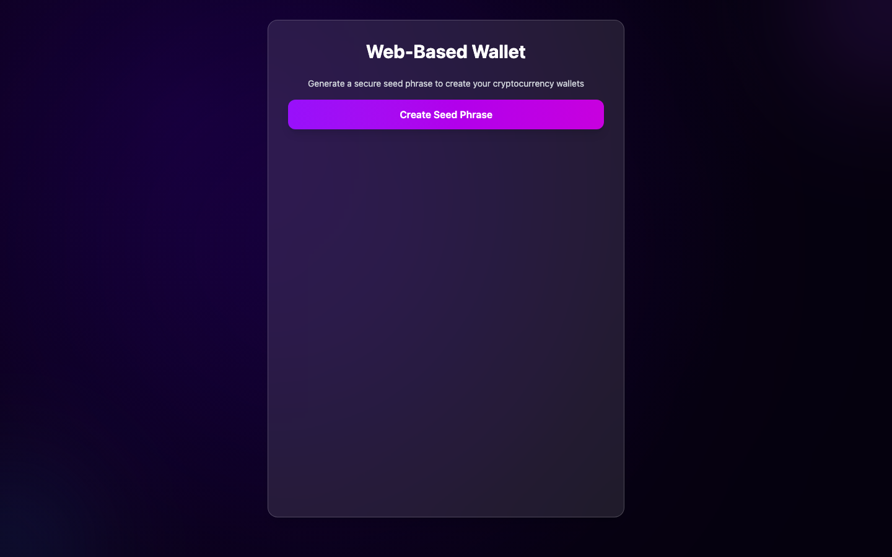

# Web-Based Cryptocurrency Wallet

A browser wallet demo supporting Ethereum and Solana account derivation and blockchain interactions. Built with React, Vite, and Tailwind CSS.

**Live demo →** [web-based-wallet-two-sable.vercel.app](https://web-based-wallet-two-sable.vercel.app)



## Features

### 🔐 Seed Phrase Generation
- Secure BIP39 mnemonic generation (12-word seed phrases)
- Visual validation of each word in the seed phrase
- Copy-to-clipboard functionality with security warnings
- Entropy strength validation for maximum security

### 💰 Multi-Chain Support
- **Ethereum Wallets**: HD wallet derivation using standard BIP44 paths
- **Solana Wallets**: Ed25519 key derivation for Solana addresses
- Hierarchical Deterministic (HD) wallet support
- Multiple wallet creation from a single seed phrase

### 📊 Balance Tracking
- Real-time balance fetching from blockchain networks
- Support for both testnet and mainnet connections
- Automatic balance updates after transactions

### 💸 Transaction Functionality
- Send ETH and SOL transactions
- Modal-based transaction interface
- Transaction status tracking and confirmation
- Address validation and error handling

### 🎨 Modern UI/UX
- Beautiful galaxy-themed design with animated backgrounds
- Glassmorphism effects with backdrop blur
- Responsive design for all screen sizes
- Smooth animations and transitions

## Technology Stack

- **Frontend**: React 19 with Vite
- **Styling**: Tailwind CSS 4.x
- **Crypto Libraries**:
  - `ethers.js` v6 - Ethereum wallet functionality
  - `@solana/web3.js` - Solana blockchain interaction
  - `bip39-web` - Mnemonic phrase generation
  - `ed25519-hd-key` - Solana key derivation
  - `tweetnacl` - Cryptographic functions

## Getting Started

### Prerequisites
- Node.js 18+ 
- npm or yarn

### Installation

```bash
# Clone the repository
git clone https://github.com/yuvrajnode/web-based-wallet.git
cd web-based-wallet

# Install dependencies
npm install

# Start development server
npm run dev

# Build for production
npm run build

# Preview production build
npm run preview
```

### Usage

1. **Generate Seed Phrase**: Click "Create Seed Phrase" to generate a secure 12-word mnemonic
2. **Secure Storage**: Write down your seed phrase and store it securely offline
3. **Create Wallets**: Use the generated seed phrase to create Ethereum and Solana wallets
4. **Manage Funds**: Check balances and send transactions
5. **Copy Keys**: Use the copy buttons to safely copy addresses and private keys

## Security Considerations

⚠️ **Important Security Notes**:

- Never share your seed phrase with anyone
- Store your seed phrase offline in a secure location
- The application runs entirely in your browser - no data is sent to external servers
- Private keys are generated locally and never transmitted
- Use testnet addresses for development and testing

## Network Configuration

### Ethereum
- **Default**: Sepolia Testnet (via browser provider)
- **Mainnet**: Configure with your own RPC endpoint
- **Required**: MetaMask or compatible Web3 wallet for balance queries

### Solana
- **Default**: Devnet
- **RPC**: `https://api.devnet.solana.com`
- **Mainnet**: Change to `https://api.mainnet-beta.solana.com`

## Project Structure

```
src/
├── components/
│   ├── EthWallet.jsx      # Ethereum wallet component
│   └── SolanaWallet.jsx   # Solana wallet component
├── App.jsx                # Main application component
├── App.css                 # Orb animation styles
├── index.css              # Galaxy background styles
└── main.jsx               # Application entry point
```

## Development

### Available Scripts

- `npm run dev` - Start development server
- `npm run build` - Build for production
- `npm run preview` - Preview production build
- `npm run lint` - Run ESLint

### Code Style

- Uses ESLint with React plugin
- React Compiler enabled for optimization
- TypeScript-ready configuration

## Contributing

1. Fork the repository
2. Create a feature branch
3. Make your changes
4. Add tests if applicable
5. Submit a pull request

## License

This project is for educational purposes.
## Support

For issues and questions:
- Check the console for error messages
- Ensure you have a stable internet connection
- Verify network configurations
- Test with small amounts first

---

**Disclaimer**: This wallet is for educational purposes. Always test with small amounts and ensure you understand the security implications before using with real funds.
